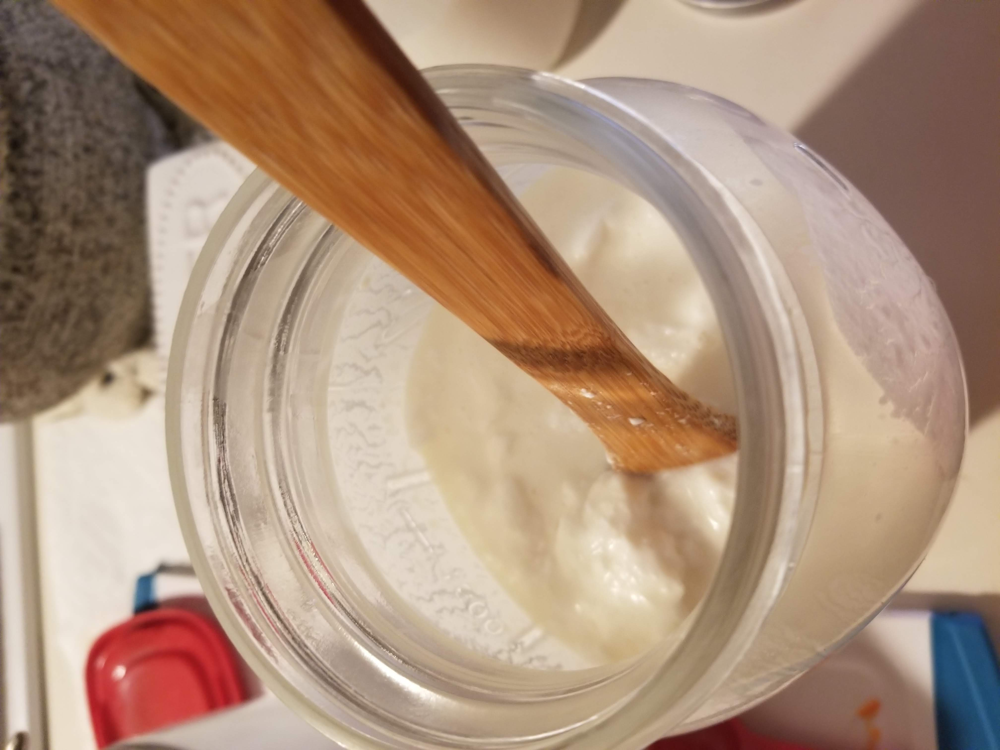
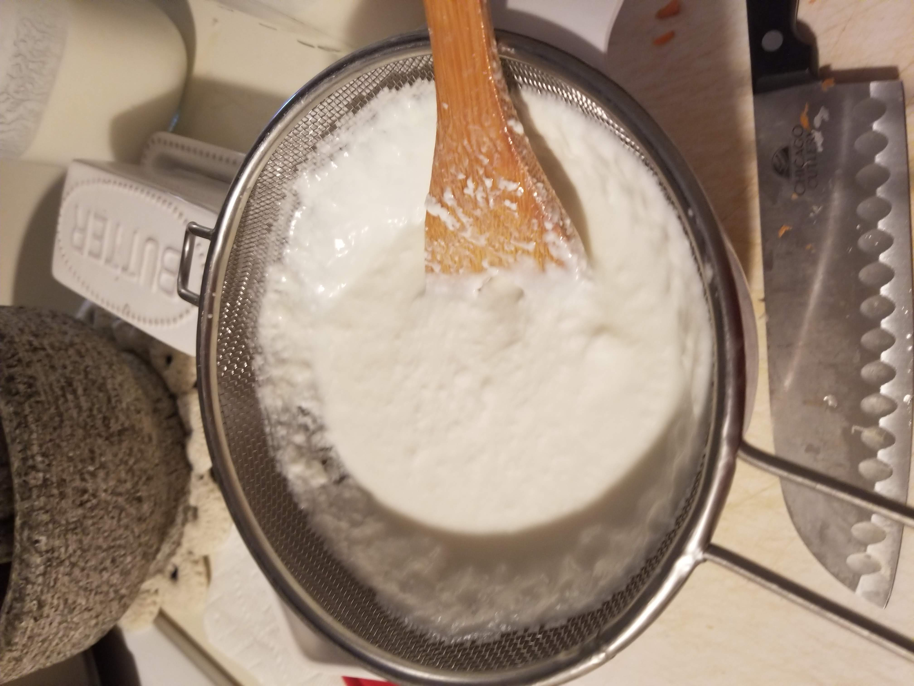

Milk kefir blah blah blah.

# Page Contents
{: .no_toc .text-mono .d-inline-block }

1. TOC placeholder text
{:toc .text-mono}

# How to Make Milk Kefir

## Tools / Items Needed

1. Milk kefir grains
2. Fine strainer
3. Milk that is not lactose-free
    * milk can be raw, but does not have to be
4. Jar(s) and other kitchen stuff

## Prepare the Jar

Add milk kefir grains and milk to the jar.

Use ratio of 1 tsp. to 1 tbsp of milk kefir grains per cup of milk.

The jar must not be airtight. Put a breathable cloth and a rubber band on top, or a loose-fitting lid.

## Let the Milk Ferment

The kefir will finish fermenting in 1-3 days, depending on the ratio of milk kefir grains to milk, the temperature of the environment, and other less-important factors.

A few times per day, vigorously stir the mixture. Either swirl the contents of the jar or insert a utensil and stir. This redistributes the kefir grains, so the milk ferments more evenly.

## Gather the Kefir

Once the milk kefir looks thick and does not move like a liquid, it is ready.

Poor the milk kefir into a bowl, through a fine strainer. Supposedly you are supposed to use a non-metal strainer, but I have only used a metal strainer. My kefir grains are very small and maybe are weak because I use a metal strainer. I should probably buy a non-metal strainer.

Stir the kefir while it is in the strainer, so the kefir goes through, and the grains do not. The grains are pretty strong, so don't worry too much about physically damaging them.

## Store the Kefir Grains for Next Use

Now you have the kefir grains in the strainer, and the grains have kefir residue on them.

Rinse kefir grains in filtered water, so the kefir residue comes off.

Store the kefir grains in the fridge, submerged in filtered water, or use immediately for a new batch of milk kefir.
